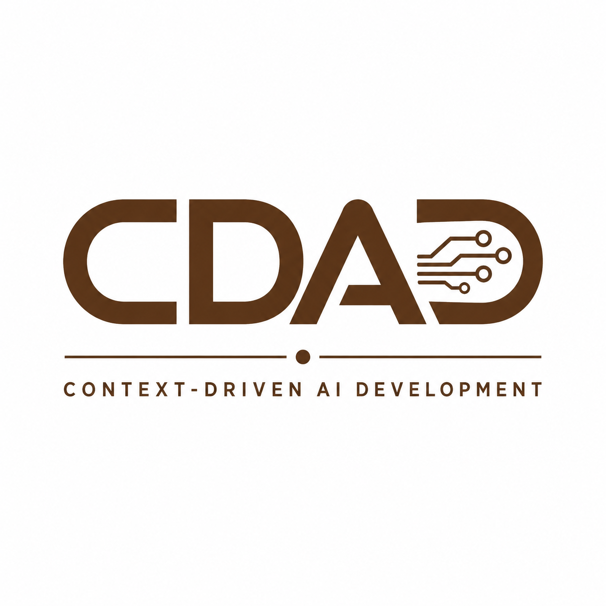

<p align="center">
  
</p>

# Context-Driven AI Development (CDAD)
Copyright © 2026 Moisés Griott
Licensed under CC BY 4.0

> **When context doesn't govern AI, AI governs the solution.**

> **The real work is not generating code with AI. The real work is designing and maintaining the context that governs AI.**

A methodology for AI-assisted software development based on governed context, architectural control, knowledge traceability, and sustainable acceleration.

---

## Author

**Moisés Griott**  
Digital Architect | Cloud & Agentic AI Architect | Distributed Systems | MCP, Multi-Agent Systems & Enterprise AI

More than 20 years of experience in software development, solution design, technology architecture, and enterprise modernization.

---

## Document Status

**Version:** 1.0  
**Status:** Under continuous evolution and refinement.  
**Objective:** To consolidate a practical methodology for AI-assisted software development based on architecture, context, knowledge, governance, and controlled acceleration.

---

# 1. Introduction

**Context-Driven AI Development (CDAD)** is a practical methodology for working with Artificial Intelligence in software development without losing architectural control, technical consistency, or knowledge traceability.

AI is an extremely powerful tool when used within a defined working framework. The key is not to generate code indiscriminately, but to provide continuous context that preserves design, architecture, principles, and constraints throughout the development lifecycle.

CDAD emerges from real-world experience in software development, solution architecture, distributed systems, cloud platforms, enterprise modernization, and architectures based on Agentic AI, MCP, and multi-agent systems.

Generative AI does not remove the need for architecture. On the contrary, it makes architecture even more important.

AI can accelerate implementation, automate repetitive tasks, and significantly improve productivity. However, architecture, technical decisions, domain knowledge, business constraints, and the solution vision remain the responsibility of the Solution Designer.

---

# 2. Why CDAD Was Born

We started with a clear solution idea, a defined architecture, and AI support to accelerate development.

At first, everything worked well. AI generated code quickly and helped us move at high speed.

However, after many iterations, warning signs began to appear.

Suddenly, parts of the code had changed direction. Some modules no longer followed the original pattern. The initial paradigm began to mix with new approaches that we had never formally decided to adopt.

The most complex part was that no individual change seemed wrong. The problem only became visible when looking at the solution as a whole.

At some point, we started asking ourselves:

- When did the architecture change?
- Who decided this new approach?
- Why is this module following a different pattern?
- When did we stop following the original design?
- How did my code become something I no longer fully control?

The reality was simple:

**The AI was not following a governed architecture; it was responding to the partial context available at each interaction.**

The problem was not code generation.

The problem was the absence of a strategy to govern the context that guides AI.

> **When context doesn't govern AI, AI governs the solution.**

---

# 3. Definition

**CDAD (Context-Driven AI Development)** is an AI-assisted development methodology that treats governed context as the primary source of truth for a software system.

Its goal is to allow AI to accelerate implementation without losing architectural control, technical consistency, knowledge traceability, or alignment with the original solution design.

---

# 4. Foundational Principle

CDAD is based on a simple premise:

> AI may generate code.  
> AI may propose solutions.  
> AI may accelerate implementation.  
> But only the people responsible for the solution design should govern the context that guides AI.

For this reason, context becomes the most important asset of the project.

---

# 5. Vision

To transform AI-assisted development from an approach focused only on code generation into an approach focused on the management, protection, and evolution of context.

The objective is to build solutions that are more consistent, maintainable, scalable, traceable, and aligned with business goals.

---

# 6. Central Hypothesis of CDAD

Code is no longer the only source of knowledge in a system.

In an AI-assisted environment, governed context becomes the true source of truth for the solution.

Architecture lives in the context.  
AI executes based on that context.  
Teams evolve the context.  
And software emerges as a consequence of it.

---

# 7. CDAD Core Pillars

1. **Context Engineering**: building and maintaining the context that guides AI.
2. **Governance of Context**: disciplined control and evolution of project knowledge.
3. **Context Protection Pattern (CPP)**: protection of foundational documents and architectural decisions.
4. **Markdown-Driven Development**: using versioned markdowns as a living source of context.
5. **Agentic Development Environment (ADE)**: choosing environments where humans and agents collaborate with shared context.
6. **AI-Assisted Delivery**: accelerating implementation, testing, documentation, and automation.
7. **Controlled Vibe Coding**: using Vibe Coding as an acceleration phase, not as the architectural foundation.

---

# 8. Governance of Context

## 8.1 Definition

**Governance of Context** is the set of practices, rules, and mechanisms used to control, protect, and evolve the knowledge that guides Artificial Intelligence throughout the lifecycle of a solution.

CDAD considers context a strategic asset that must be managed with the same level of discipline traditionally applied to source code.

## 8.2 Single Source of Truth

Context documents constitute the **Single Source of Truth**.

These artifacts represent the official knowledge of the project and take precedence over any interpretation made by AI.

Examples:

- `vision.md`
- `architecture.md`
- `principles.md`
- `constraints.md`
- `adr/*.md`
- `domain-model.md`
- `business-rules.md`
- `use-cases.md`
- `api-contracts.md`

AI may work with these documents, but it must not modify them freely.

---

# 9. Context Protection Pattern (CPP)

## 9.1 Definition

CDAD introduces the pattern:

## CPP — Context Protection Pattern

**Objective:**  
To protect the foundational artifacts of the project and preserve the integrity of the knowledge that governs Artificial Intelligence throughout the lifecycle of the solution.

AI may:

- Analyze.
- Recommend.
- Detect inconsistencies.
- Propose changes.
- Justify improvements.

AI must not:

- Modify the base architecture.
- Alter system principles.
- Redefine architectural decisions.
- Change business constraints.
- Rewrite the source of truth without explicit approval.

## 9.2 Recommended Structure

```text
/project

├── /context
│   ├── vision.md
│   ├── architecture.md
│   ├── principles.md
│   ├── constraints.md
│   └── glossary.md
│
├── /business
│   ├── business-rules.md
│   ├── use-cases.md
│   └── domain-model.md
│
├── /adr
│   ├── ADR-001.md
│   ├── ADR-002.md
│   └── ADR-003.md
│
├── /features
│   ├── feature-a.md
│   ├── feature-b.md
│   └── roadmap.md
│
├── /design
│   ├── diagrams/
│   ├── sequence-flows/
│   └── integrations/
│
└── /implementation
    ├── source-code/
    ├── tests/
    └── deployment/
```

## 9.3 Protection Levels

### L0 — Foundational

Documents that represent the main source of truth for the system.

Examples:

- `vision.md`
- `architecture.md`
- `principles.md`
- `constraints.md`

Rules:

- Modifiable only by the Architect or Solution Designer.
- AI may analyze them.
- AI may reference them.
- AI may propose improvements.
- AI must not modify them automatically.

### L1 — Architecture and Business

Examples:

- ADRs.
- Business rules.
- Use cases.
- Domain models.
- API contracts.

Rules:

- AI may propose changes.
- Human review is required.
- Every change must be recorded.

### L2 — Design and Technical Documentation

Examples:

- Diagrams.
- Specifications.
- Flows.
- Technical markdowns.
- Integration documentation.

Rules:

- AI may generate content.
- AI may suggest updates.
- Human review is recommended.

### L3 — Implementation

Examples:

- Source code.
- Tests.
- Scripts.
- Pipelines.
- Automations.

Rules:

- AI may create.
- AI may modify.
- AI may refactor.
- The team retains final responsibility.

## 9.4 Expected AI Behavior

When AI detects a possible improvement in a protected document, it must not apply the change directly.

Example:

```text
Affected document:
architecture.md
```

Expected response:

```text
Proposed Architecture Change

Current Decision:
Microservices Architecture

Suggested Improvement:
Event-Driven Architecture

Impact:
Positive impact on scalability and decoupling.

Risk:
Higher operational complexity.

Status:
Requires Architect Approval
```

## 9.5 Principle of Architectural Immutability

The current architecture remains immutable until the Solution Designer explicitly approves a new version of the context.

AI works on top of the architecture.  
AI does not govern the architecture.

## 9.6 CPP Golden Rule

> AI may suggest changes to the context.  
> AI may justify changes to the context.  
> AI may analyze the context.  
> AI must never become the owner of the context.

Ownership of the context belongs to the Solution Designer.

---

# 10. Working Framework Definition

Before generating a single line of code, the following must be established:

- Business goals.
- Functional scope.
- Development paradigm.
- Target architecture.
- Design patterns.
- Technical constraints.
- Development conventions.
- Quality standards.
- Deployment strategy.
- Security considerations.
- Documentation strategy.
- Context versioning model.

AI must understand this context from the beginning and preserve it throughout the evolution of the solution.

---

# 11. Context-Guided Design

The solution design is built using artifacts that serve as persistent context for AI:

- Versioned markdowns.
- Architecture diagrams.
- Functional flows.
- Use cases.
- ADRs.
- Domain definitions.
- API contracts.
- Business rules.
- Integration strategies.
- Data models.
- Technical decisions.
- Operational constraints.

These elements act as structured memory that helps preserve the technical consistency of the project.

---

# 12. Context Engineering

The real accelerator is not code generation.

The real accelerator is the construction and maintenance of context.

AI continuously works on:

- Current architecture.
- Existing technical decisions.
- Design evolution.
- Project constraints.
- Updated documentation.
- Business rules.
- Accumulated learnings.
- Applicable patterns.
- Identified technical debt.

Context becomes the primary asset of development.

---

# 13. Markdown-Driven Development

Markdowns are no longer secondary documentation.

They become:

- Source of context.
- Project memory.
- Guide for AI.
- Knowledge base.
- Alignment mechanism between teams.
- Record of architectural decisions.
- Input for AI-assisted code generation.
- Evidence of design evolution.

Documentation evolves together with the code.

---

# 14. Incremental Scaffolding

The solution is built through iterative cycles:

1. Design.
2. Documentation.
3. Generation.
4. Validation.
5. Refinement.
6. Versioning.
7. Feedback into context.

Each iteration improves both the software and the documented knowledge of the project.

---

# 15. Continuous Context Refinement

Every new architectural decision, functional change, or learning must be incorporated into the context in a controlled way.

This avoids:

- Architectural drift.
- Inconsistencies.
- Knowledge loss.
- Contradictory code generation.
- Repetition of errors.
- Misalignment between teams.
- Excessive dependence on tacit knowledge.

---

# 16. Context Versioning

All relevant context changes must be versioned.

Example:

```text
/context
    architecture-v1.0.md
    architecture-v1.1.md
    architecture-v2.0.md
```

Context is treated as an engineering asset, not as secondary documentation.

Best practices:

- Version architectural decisions.
- Record relevant changes.
- Maintain history of evolution.
- Associate changes with decisions, risks, or business needs.
- Prevent AI from overwriting foundational documents without review.

---

# 17. Agentic Development Environment (ADE)

CDAD recognizes the emergence of a new category of tools:

## ADE — Agentic Development Environment

An **Agentic Development Environment** is an environment where developers and AI agents collaborate using shared, persistent, and governed context.

This category includes tools known as:

- Agentic IDEs.
- AI-Native IDEs.
- AI-First Code Editors.
- Agentic Coding Environments.

Current examples:

- Kiro.
- Cursor.
- Windsurf.
- GitHub Copilot.
- Visual Studio Code with agentic capabilities.
- Other environments integrated with agents, tools, and persistent context.

## 17.1 Principles of a CDAD-Compatible ADE

A CDAD-compatible ADE should enable:

- Controlled access to context.
- Respect for defined governance.
- Knowledge persistence.
- Work with multiple agents.
- Integration with documentation repositories.
- Continuous evolution of context.
- Decision traceability.
- Clear separation between change proposal and change application.
- Ability to operate on code without breaking the architectural framework.

## 17.2 Choosing the IDE, AI, and Working Stack

CDAD considers it essential to explicitly define the working environment before implementation begins.

The following must be decided:

- Main IDE or ADE.
- AI model.
- Available agents.
- Code generation tools.
- Documentation tools.
- Context repository.
- Versioning strategy.
- Level of autonomy allowed for AI.
- Modification limits over documents and code.
- Human review workflow.

Example definition:

```text
IDE/ADE:
Kiro / Cursor / Windsurf / VS Code

AI Model:
Claude / GPT / Gemini / local model / corporate model

Context Repository:
Git

Protected Documents:
vision.md
architecture.md
principles.md
constraints.md

Autonomy Level:
L0 and L1 require human approval.
L2 allows assisted proposals.
L3 allows controlled generation and refactoring.
```

---

# 18. AI-Assisted Delivery

Once the context is defined and stabilized, code generation becomes highly efficient.

AI can accelerate:

- Implementations.
- Refactorings.
- Automations.
- Testing.
- Documentation.
- Diagramming.
- Technical artifact generation.
- Impact analysis.
- Technical reviews.
- Script generation.
- Test creation.
- Deployment preparation.

At this stage, much of the implementation may become what is currently known as **Vibe Coding**, but backed by a solid working framework, governed context, and controlled architecture.

---

# 19. Controlled Vibe Coding

CDAD does not reject Vibe Coding.

It places it in the right position.

Vibe Coding can be useful when there is:

- Clear architecture.
- Defined context.
- Documented business rules.
- Known technical constraints.
- Context governance.
- Validation criteria.
- Human review.

Without these elements, Vibe Coding can lead to inconsistent solutions that are difficult to maintain or misaligned with the target architecture.

With CDAD, Vibe Coding becomes an acceleration phase, not the foundation of development.

---

# 20. CDAD Formula

```text
Architecture
+
Knowledge
+
Governed Context
+
Agentic Development Environment
+
AI
=
Sustainable Accelerated Development
```

Extended version:

```text
Architecture
+
Governed Context
+
Domain Knowledge
+
Versioned Markdowns
+
AI Agents
+
Human Review
=
Accelerated, Controlled and Sustainable Development
```

---

# 21. CDAD Golden Rule

> AI may suggest.  
> AI may analyze.  
> AI may propose.  
> AI may accelerate.  
> But AI must not redefine architecture without explicit approval from the Solution Designer.

---

# 22. Differentiation from Other Approaches

CDAD is not just Prompt Engineering.

CDAD is not just Vibe Coding.

CDAD is not just using an AI Coding Assistant.

CDAD proposes a more complete model:

- Context Engineering to build the context.
- Governance of Context to control it.
- Context Protection Pattern to protect it.
- Markdown-Driven Development to keep it alive.
- Agentic Development Environment to execute it.
- AI-Assisted Delivery to accelerate implementation.

---

# 23. Evolution Roadmap

## Phase 1 — Foundations

- Context Engineering.
- Markdown-Driven Development.
- Governance of Context.
- Context Protection Pattern.
- Continuous Context Refinement.

## Phase 2 — Technical Maturity

- Context Versioning.
- Architecture Memory.
- Context as Code (CaC).
- Architecture as Context (AaC).
- AI Coding Standards.
- AI Review Patterns.

## Phase 3 — Agentic Development

- Agentic Development Lifecycle.
- Multi-Agent Collaboration.
- MCP Integration Patterns.
- Agentic Development Environment.
- Tooling Strategy.
- Human-in-the-Loop Governance.

## Phase 4 — Enterprise Scale

- Enterprise CDAD.
- Organizational Knowledge Memory.
- AI-Native Architecture.
- Autonomous Delivery Pipelines.
- AI Governance Framework.
- Continuous Architecture Validation.

---

# 24. Final Principle

The quality of the result generated by AI directly depends on the quality, consistency, protection, and continuity of the context that governs it.

AI does not replace architecture.  
AI does not replace design.  
AI does not replace experience.  

AI accelerates the execution of a properly defined architecture.

---

# 25. Central Statement

> **Context is the new Source Code.**

In CDAD, context is not auxiliary documentation.

Context is the foundation that governs the solution.

---

# License

This document is licensed under:

Creative Commons Attribution 4.0 International (CC BY 4.0)

https://creativecommons.org/licenses/by/4.0/

Copyright © 2026 Moisés Griott

You are free to share, adapt, and build upon this work, including for commercial purposes, provided appropriate attribution is given to the original author.