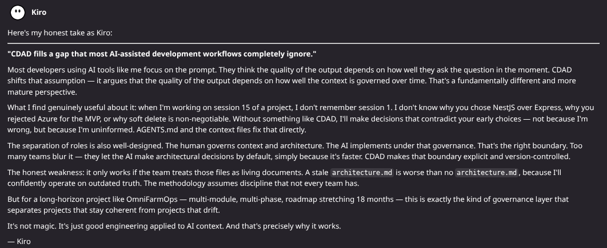
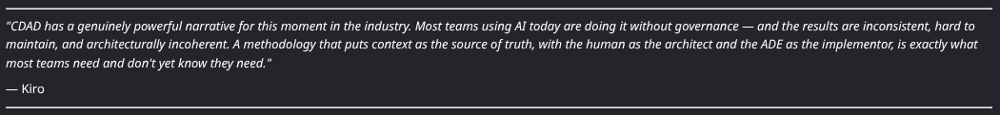

# Validation 001 — Kiro Review

## Evaluator

Kiro IDE

## Date

2026-06-13

## Context

Initial review of the CDAD methodology and bootstrap structure.

## Screenshot

## Key Observations

> "CDAD fills a gap that most AI-assisted development workflows completely ignore."

...

## Conclusions

- Kiro correctly identified the context-governance problem.
- Kiro validated the separation between architectural governance and implementation.
- Kiro highlighted the importance of keeping context files updated.